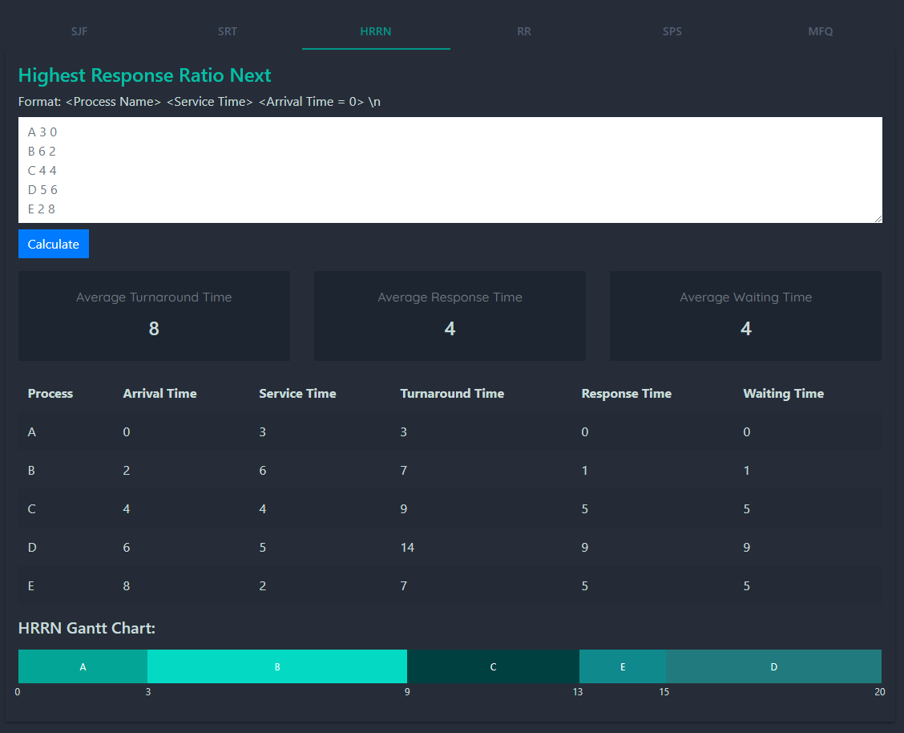
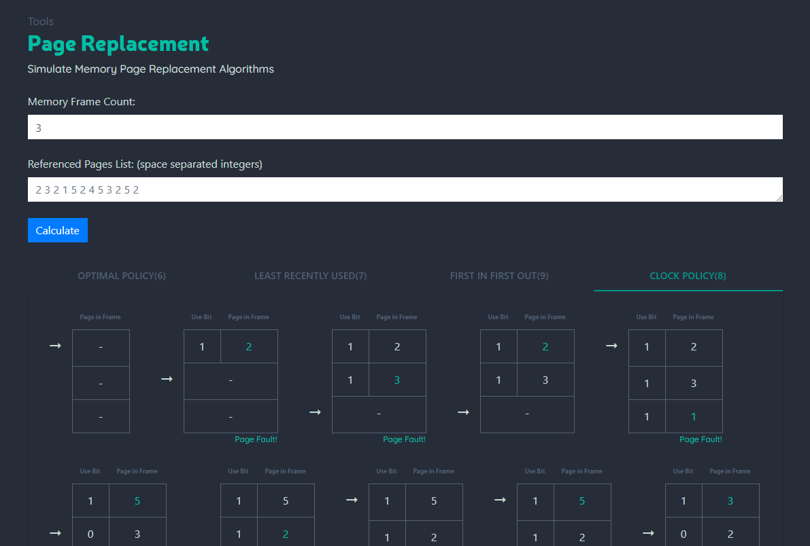

# [os.aligator.ir](os.aligator.ir)

## Screenshots

## How to run
1. Make sure you have: `Dart Sdk 2.10.4`
2. If you don't have `webdev` install it using: `dart pub global activate webdev`
3. Open this project
4. run `pub get` to resolve dependencies
5. then run: `webdev run` to start dart2js transpiler
6. The Project should start running
(The build process may take a minute or two)

If you have Intellij and the dart sdk and the dart plugin installed,
 every thing should be configured to work when you hit the run button. 